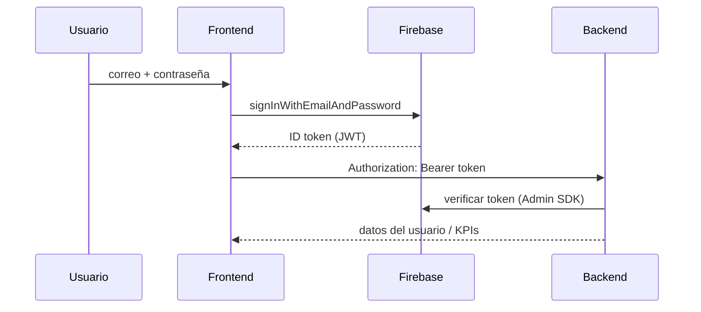

# Ruralia Frontend — Documentación

Panel web de gestión para el ecosistema Ruralia. Construido con **Next.js 16**, **React 19**, **Tailwind CSS 4** y **Firebase Auth**.

---

## Stack

| Tecnología | Uso |
|------------|-----|
| Next.js 16 (App Router) | Framework, puerto dev `3001` |
| Firebase Auth | Inicio de sesión (email/contraseña) |
| Tailwind CSS 4 | Estilos (paleta verde esmeralda) |
| Backend NestJS | API REST en `NEXT_PUBLIC_API_URL` (default `http://localhost:3000`) |

---

## Variables de entorno

Copiar `.env.example` → `.env.local`:

| Variable | Descripción |
|----------|-------------|
| `NEXT_PUBLIC_FIREBASE_*` | Config web de Firebase Console |
| `NEXT_PUBLIC_API_URL` | URL del backend NestJS |

---

## Conexión con el backend



### Endpoints consumidos

| Módulo frontend | Endpoint backend | Sesión backend |
|-----------------|------------------|----------------|
| Auth | `GET /autenticacion/yo` | 02 |
| Dashboard KPIs | `GET /proyectos?estado=ACTIVO&limite=1` (campo `total`) | 03 |
| Dashboard KPIs | `GET /proyectos?limite=1` | 03 |
| Dashboard KPIs | `GET /jornadas?limite=1` | 05 |
| Dashboard KPIs | `GET /indicadores` | 06 |
| Dashboard lista | `GET /proyectos?estado=ACTIVO&limite=5` | 03 |
| Usuarios CRUD | `GET/POST/PATCH/DELETE /usuarios` | 07 (frontend sesión 03) |
| Proyectos CRUD | `GET/POST/PATCH/DELETE /proyectos` | 03 |

Documentación completa del backend: [`ruralia-backend/docs/`](../ruralia-backend/docs/)

---

## Estructura del proyecto

```
ruralia-frontend/
├── app/
│   ├── layout.tsx          # Layout raíz, metadata
│   ├── page.tsx            # Página principal → AuthPanel
│   └── globals.css
├── components/
│   ├── auth-panel.tsx      # Login + enrutamiento post-auth
│   ├── dashboard.tsx       # Shell con sidebar
│   ├── dashboard-inicio.tsx
│   ├── sidebar.tsx
│   ├── gestion-usuarios.tsx
│   ├── gestion-proyectos.tsx
│   └── ui/modal.tsx
├── lib/
│   ├── api.ts              # Cliente HTTP al backend
│   ├── firebase.ts         # Inicialización Firebase
│   └── types.ts            # Tipos compartidos
└── docs/                   # Bitácora de sesiones (este directorio)
```

---

## Comandos

```bash
pnpm install
pnpm dev      # http://localhost:3001
pnpm build
pnpm start
```

---

## Historial de sesiones

| Sesión | Archivo | Contenido |
|--------|---------|-----------|
| 01 | [SESION-01-autenticacion-firebase.md](./SESION-01-autenticacion-firebase.md) | Login Firebase + prueba backend |
| 02 | [SESION-02-dashboard-kpis.md](./SESION-02-dashboard-kpis.md) | Dashboard con KPIs, sin registro público |
| 03 | [SESION-03-sidebar-usuarios-proyectos.md](./SESION-03-sidebar-usuarios-proyectos.md) | Sidebar, CRUD usuarios y proyectos |
| 04 | [SESION-04-admin-proyectos.md](./SESION-04-admin-proyectos.md) | App Router, cards, gestión con tabs |

---

## Relación con otros repos

| Repo | Rol |
|------|-----|
| `ruralia-backend` | API NestJS, PostgreSQL, Firebase Admin |
| `ruralia-mobile` | App Capacitor para técnicos de campo (offline) |
| `ruralia-frontend` | Panel web de coordinación y reportes |

La app móvil y el frontend comparten el mismo proyecto Firebase (`ruralia-35836`) y el mismo backend.
