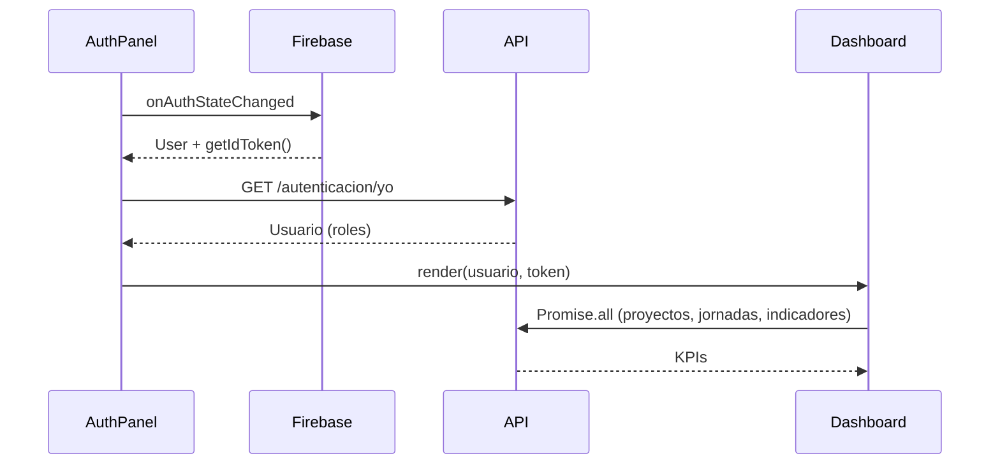

# Ruralia Frontend — Documentación de sesión 02

> **Fecha:** 4 de julio de 2026  
> **Sesión:** Dashboard con KPIs y acceso restringido (sin registro público)

---

## Objetivo

Tras iniciar sesión, mostrar un dashboard con indicadores clave del sistema. Eliminar la pestaña de registro del login porque la alta de usuarios será solo interna (administradores).

---

## Cambios realizados

### Login simplificado (`components/auth-panel.tsx`)

- Eliminada pestaña "Registrarse" y todo el flujo `createUserWithEmailAndPassword`
- Formulario único de inicio de sesión
- Nota al pie: "El registro de usuarios es interno"
- Tras login exitoso, carga automática del usuario backend (sin botón "Probar backend")
- Redirección implícita al dashboard cuando hay sesión válida

### Dashboard (`components/dashboard.tsx`)

Nuevo componente con:

| KPI | Fuente backend |
|-----|----------------|
| **Proyectos activos** (destacado) | `GET /proyectos?estado=ACTIVO&limite=1` → `total` |
| Total proyectos | `GET /proyectos?limite=1` → `total` |
| Jornadas de campo | `GET /jornadas?limite=1` → `total` |
| Indicadores | `GET /indicadores` → `length` |

Además, lista de hasta 5 proyectos activos recientes.

Header con nombre del usuario, roles y botón "Cerrar sesión".

### Cliente API ampliado (`lib/api.ts`)

- `fetchConAuth<T>()` — helper genérico con Bearer token
- `listarProyectos(token, params?)` — paginación y filtros
- `contarProyectos(token, estado?)` — atajo para obtener `total`
- `obtenerKpisDashboard(token)` — consultas en paralelo con `Promise.all`

### Tipos (`lib/types.ts`)

- `EstadoProyecto`, `TipoProyecto`, `Proyecto`
- `RespuestaPaginada<T>`, `KpisDashboard`

### Metadata (`app/layout.tsx`)

- Título actualizado a "Ruralia — Panel de gestión"

---

## Endpoints del backend utilizados

Documentados en detalle en:

| Endpoint | Doc backend |
|----------|-------------|
| `GET /autenticacion/yo` | [SESION-02](../../ruralia-backend/docs/SESION-02-autenticacion-firebase.md) |
| `GET /proyectos` | [SESION-03](../../ruralia-backend/docs/SESION-03-crud-proyectos.md) |
| `GET /jornadas` | [SESION-05](../../ruralia-backend/docs/SESION-05-jornadas-formularios.md) |
| `GET /indicadores` | [SESION-06](../../ruralia-backend/docs/SESION-06-indicadores-reportes-swagger.md) |

---

## Flujo post-login

---

## Decisiones de diseño

- **Sin registro público:** los usuarios se crean internamente en Firebase Console o por un flujo admin futuro
- **KPIs vía `total` paginado:** se usa `limite=1` para minimizar payload; el backend devuelve el conteo total en la respuesta paginada
- **Proyectos activos destacados:** tarjeta principal en verde esmeralda, coherente con la identidad visual

---

## Pendiente (próximas sesiones)

- [ ] Navegación lateral: proyectos, jornadas, indicadores, reportes
- [ ] CRUD de proyectos desde el panel
- [ ] Renovación automática del token Firebase antes de expirar (1 h)
- [ ] Protección de rutas con middleware Next.js
- [ ] Vista de reportes (`GET /reportes/proyecto/:id/*`) para coordinadores

---

## Historial de sesiones frontend

| Sesión | Contenido |
|--------|-----------|
| 01 | Autenticación Firebase + prueba backend |
| 02 | Dashboard KPIs, login sin registro |
