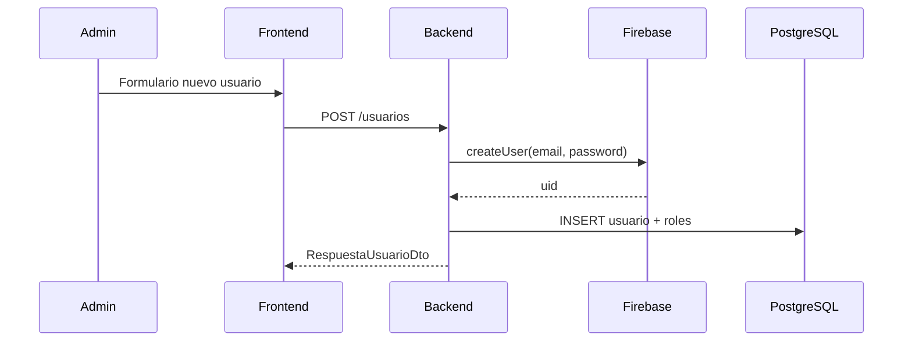

# Ruralia Frontend — Documentación de sesión 03

> **Fecha:** 4 de julio de 2026  
> **Sesión:** Sidebar, gestión de usuarios y gestión de proyectos

---

## Objetivo

Agregar navegación lateral con tres secciones: Dashboard, Usuarios y Proyectos. Implementar CRUD completo en las dos pestañas de gestión.

---

## Cambios en el frontend

### Layout con sidebar

| Archivo | Descripción |
|---------|-------------|
| `components/sidebar.tsx` | Navegación lateral (Dashboard, Usuarios, Proyectos) |
| `components/dashboard.tsx` | Shell: sidebar + header + contenido según sección |
| `components/dashboard-inicio.tsx` | KPIs (extraído de sesión 02) |
| `components/ui/modal.tsx` | Modal reutilizable, spinner y alertas |

La pestaña **Usuarios** solo aparece si el usuario logueado tiene rol `ADMINISTRADOR`.

### Gestión de usuarios (`components/gestion-usuarios.tsx`)

| Acción | UI | Endpoint |
|--------|-----|----------|
| Listar | Tabla paginada + búsqueda | `GET /usuarios` |
| Ver | Modal detalle | `GET /usuarios/:id` |
| Crear | Modal formulario | `POST /usuarios` |
| Editar | Modal formulario | `PATCH /usuarios/:id` |
| Eliminar | Confirmación → desactivar | `DELETE /usuarios/:id` |

Campos del formulario: nombre, correo, contraseña, roles (multi-select), estado activo (solo edición).

### Gestión de proyectos (`components/gestion-proyectos.tsx`)

| Acción | UI | Endpoint |
|--------|-----|----------|
| Listar | Tabla paginada + búsqueda + filtro estado | `GET /proyectos` |
| Ver | Modal detalle | `GET /proyectos/:id` |
| Crear | Modal formulario | `POST /proyectos` |
| Editar | Modal formulario | `PATCH /proyectos/:id` |
| Suspender | Confirmación | `DELETE /proyectos/:id` |

Campos: nombre, descripción, tipo, fechas inicio/fin.

---

## Cambios en el backend (nuevo módulo usuarios)

El backend no tenía API de usuarios; se implementó en esta sesión.

### Endpoints (`/usuarios`) — solo `ADMINISTRADOR`

| Método | Ruta | Descripción |
|--------|------|-------------|
| GET | `/usuarios/roles` | Roles disponibles |
| GET | `/usuarios` | Listar con filtros y paginación |
| GET | `/usuarios/:id` | Detalle |
| POST | `/usuarios` | Crear en Firebase + PostgreSQL |
| PATCH | `/usuarios/:id` | Actualizar datos, roles y estado |
| DELETE | `/usuarios/:id` | Desactivar (soft delete + Firebase disabled) |

### Firebase Admin ampliado

`FirebaseAdminService` ahora expone:
- `crearUsuario(correo, contraseña, nombre)`
- `actualizarUsuario(uid, { correo, contraseña, nombre, deshabilitado })`
- `eliminarUsuario(uid)` — rollback si falla la BD al crear

### Archivos backend nuevos

```
src/usuarios/
├── dto/
│   ├── crear-usuario.dto.ts
│   ├── actualizar-usuario.dto.ts
│   └── filtros-usuario.dto.ts
├── utils/serializar-usuario.ts
├── usuarios.service.ts
└── usuarios.controller.ts
```

---

## Flujo de creación de usuario interno



---

## Pendiente (próximas sesiones)

- [ ] Sidebar responsive (colapsable en móvil)
- [ ] Activar proyectos (cambiar estado BORRADOR → ACTIVO)
- [ ] Vista detalle de proyecto con pestañas (actividades, personal, veredas)
- [ ] Middleware Next.js para proteger rutas
- [ ] Notificaciones toast en lugar de alertas estáticas

---

## Historial de sesiones frontend

| Sesión | Contenido |
|--------|-----------|
| 01 | Autenticación Firebase |
| 02 | Dashboard KPIs, sin registro público |
| 03 | Sidebar, CRUD usuarios y proyectos |
